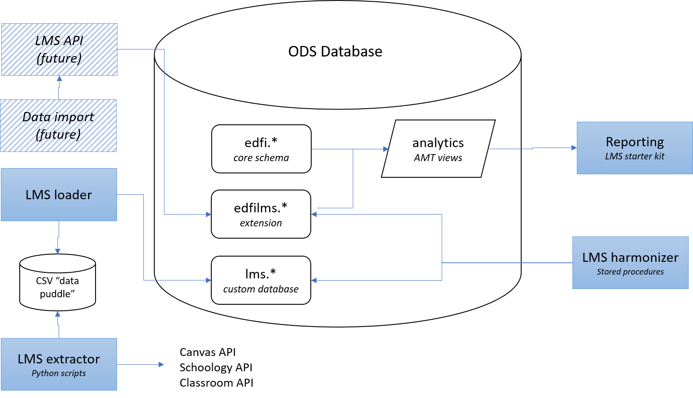

# LMS API

## Purpose of this Document   

The future, long-term vision for LMS integration in the Ed-Fi community is for
data to flow directly from the LMS to the Ed-Fi ODS platform via a standardized
Ed-Fi API.  However, the timing of a move from current community ETL
processes  to direct system-to-system communications is not known. 

The current [LMS Toolkit](/display/OTD/LMS+Toolkit) is such an ETL process, but
its ETL focus is mostly as an expedient to making data from LMS system available
today; it is not seen as the optimal long-term approach.

Broadly the purpose of this document is to plan for a transition to API-based
transfer at a future date, and to raise questions that can be used to inform
current programs and products.

## Options for an LMS API

In envisioning direct system-to-system integration scenarios for LMS data into
analytics, we envision that transfer occurring via REST APIs that are compatible
with (i.e., deployable on and through) the current Ed-Fi ODS platform and its
technology, using standard platform mechanisms for doing so.

However, there are open questions about how this API should be behave in terms
of data it captures and how it enforces referentiality to SIS data.

There are 2 main and related questions:

1.  Should the LMS API capture entities that cannot be related to the core SIS
    data entities?
2.  Should the LMS API reject data if the relation to SIS entities cannot be
    precisely established at transfer time?

### Question #1

The SIS tends to capture the elements in K12 that are most central, formal, and
closely monitored: students, grades, sections, and the like. The LMS has
representations of these entities, but the LMS also captures a lot of elements
that are less formalized than those of the SIS: assignments, course activity,
online discussion, etc. In terms of the data elements that overlap from the SIS
to the LMS (students, staff, sections, etc.), the SIS tends to house the
"canonical" list and the LMS a derivative, and often expanded, list.

In the LMS, K12 elements such as clubs, teacher communities of practice, library
programs, and the like will commonly be represented as LMS sections. Further, on
occasion people entities not captured in the SIS will also have identities and
appear in the LMS: guest speakers, school volunteer staff, etc.

So question #1 is essentially asking: do we want to capture these "extra" LMS
entities and the data that relates to these entities?

**Recommendation**: the current belief is that this "extra" LMS data is
interesting but not a priority; it is therefore **non-essential** and **should
not currently be a focus of the long-term API strategy.**

* Such data is very loose, shaped by local norms, and subject to interpretation.
  It would be hard to derive authoritative, specific recommendations for student
  improvement from this data.
* Such data is often "crammed into" a LMS entity in a non-semantic way: an
  "after-school club" is not a "section." A sign that such operational elements
  "matter more" is that they would have their own semantic representation in the
  source system. In such a case, that representation (a LMS "after-school
  club")  would/could be carried over to Ed-Fi's data model in the form of a
  parallel entity (an Ed-Fi "after school club")

## Question #2

Question #2 is related to question #1: if the SIS has no representation of
an "after-school club" but LMS does have that representation  then clearly we
cannot "relate" the LMS data to the SIS data. If we try to lookup the SIS
section that represents the "after school club" it will not exist.

But question #2 also goes beyond question #1 as it is trying to raise the
question of where data quality and cleanup should occur. Take this example:

Student A enrolls in the district and attends school the next day. However, due
to a internal process issue, the student's section enrollments do not fully
complete as some are marked as "provisional" pending review of meeting entry
requirements.

When the student shows up to school, she is not on the LMS roster in all
classes, so the school administrator adds her directly so that she can fully
participate in all classes. She attends classes and completes initial
assignments.

When the LMS attempts to communicate assignment data that evening to the Ed-Fi
API, the assignment is linked to a section enrollment that does not yet exist in
the SIS (it is "pending"). What happens?

1. Should the transaction be refused as it can't be linked to a SIS section?
2. Or should it be accepted, and possibly fixed later, or simply left out of
   downstream analytics?

This case is obviously somewhat hypothetical but not unrealistic. In some data
domains there are often strong process reasons why "joining" data is difficult.
The classic example is student transcripts for transfer students: it can be very
difficult to tie a student's course records back to a districts course codes
when the student has transferred in, so many times districts skip this step,
opting instead to accept poorer-quality data in the student transcript. They
"degrade" the data on purpose, and this caused significant preferentiality
issues for years (and still does) in the Ed-Fi community.

However, in the LMS domain, the main SIS entities to join to – at least
initially –  are believed to be quite small and highly regulated: students and
sections.

**Recommendation**: given this limited scope of references to SIS entities and
the highly regulated nature of the key SIS connections, the recommendation is
for the **API to reject data transactions when the key referenced data elements
cannot be located in the SIS**.

As LMS integrations grow they could start to overlap with less-well-regulated
SIS data entities, and it could be advantageous to consider relaxing this
requirement in those cases.

For example, consider sourcing attendance information from the LMS: the parallel
entities on the SIS side are considerably more "loose" and less well-maintained
(attendance data is frequently left in a "wrong" state for days). In such cases,
some amount of relaxing or low-referentiality may be merited.

## Complexities in Joining SIS and LMS Data

This is covered in [LMS - Joining Entities across
Systems](./JOINING-ACROSS-ENTITIES.md)

## Design Proposal

Given all these recommendations and principles, the proposal is to drive an
initial API implementation off the edfilms extension schema.

