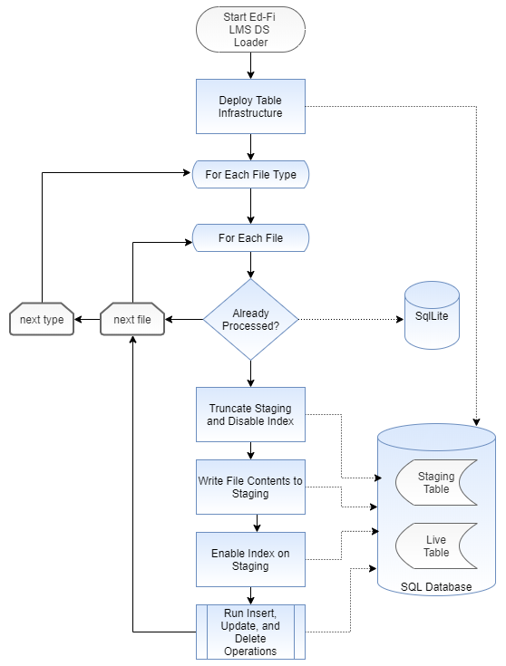

# LMS Data Store Loader

## Overview

The LMS Data Store Loader (aka LMS-DS Loader) pushes CSV files into a relational
database, currently supporting SQL Server.

## File Processing Architecture

## Data Model

The database tables closely mirror the LMS UDM with one key exception: every
table has a synthetic primary key, while the natural key (SourceSystemIdentifier
, SourceSystem) continues to be treated as a unique secondary index. Foreign key
relationships use the synthetic key instead of the natural key. This design
represents the dominant pattern of relational database development, unlike the
Ed-Fi ODS that uses natural keys as primary and foreign keys (cf Key Structure).

## Staging and Live Table Pairs

Inserts, updates, and deletes require some knowledge of the data already present
in the database. To optimize the performance, we will perform a fast insert of
entire files into a staging table (a regular table, optimized for temporary
usage), followed by execution of pure SQL statements to perform insert, update,
and delete functions.

The upload to the staging table will be optimized by starting with a clean slate
on each execution:

1. Truncate the staging table
1. Disable natural key index on the staging table
1. Upload records into the staging table
1. Enable natural key index
1. Perform operations to load data into the live table.

This process is highly optimized for insert performance and it requires that the
account running the tool has permission to alter database schemas (`db_ddladmin`
in SQL Server). This may be a security concern in many settings. For that
reason, the LMS tables should go into a distinct database that is segregated
from the ODS database, so that the enhanced permissions are not granted in the
ODS database.

This is an area that may need community feedback.

## Updates

Updates will depend on the LastModified date in the CSV file. This forces a
requirement back on the Extractors: if the API responses do not contain a
modification date, then the extractors need to determine that date before
creating the CSV files.

## Soft Deletes

See [Soft Deleting LMS Data](./SOFT-DELETES.md)

## Avoiding Reprocessing Files

The utility logs the full path (directory and file name) of every file that it
reads, so that it can avoid accidentally re-processing files.
