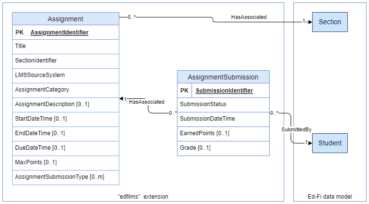

# LMS Extension

## Overview

This extension has been built to support interchange and storage of a Learning
Management System's data about Assignment and Assignment Submissions. The work
is being tested and supported on [Ed-Fi Data Standard
v3.3](/display/EFDS33/Ed-Fi+Data+Standard+v3.3); however, it should, in theory,
work on older data standards as well.

## Key Entities

* `Assignment`  represents an assignment from a source Learning Management
  System (LMS), which is associated with a _Section._
* `AssignmentSubmission`  represents a _Student's_ turned-in assignment
  submission.

## Key Concepts

* The Assignment has two ways to refer to an associated Section:
  * Via the `SectionIdentifier` property
  * As an optional reference to the Ed-Fi `Section`.
* The reference to `Section`  also contains a `SectionIdentifier` ; the
  two `SectionIdentifier`  properties will be merged in the implementation code.

## Model Diagram

> [!INFO] The Ed-Fi Data Standard since version 3.2 has included
> a `SourceSystemDescriptor` . We are choosing not to use that descriptor, so
> that the LMS Toolkit can also be integrated with older data standards.

## Descriptors

|                      |                                |                                                           |                                      |
| -------------------- | ------------------------------ | --------------------------------------------------------- | ------------------------------------ |
| Entity               | Name                           | Description                                               | Usage Classification                 |
| Assignment           | AssignmentSubmissionType​\*    | ​The type or mode of submission                           | Standard (separate standard per LMS) |
| AssignmentCategory   | The category of assignment     | Standard (separate standard per LMS)                      |
| LMSSourceSystem      | The upstream LMS source system | Flexible                                                  |
| AssignmentSubmission | SubmissionStatus               | The current status of the student's assignment submission | Standard (separate standard per LMS) |

\* Currently only used by Canvas
