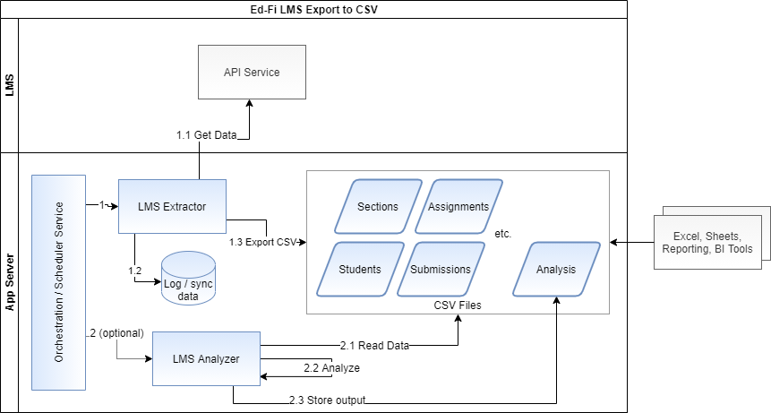

# LMS Extractors

## Overview

Utilities that extracts data from important K12 instructional systems and merges that data into a common format (LMS Unifying Data Model), as CSV files. Extractors are available for the following platforms (links to source code):

* Canvas
* Google Classroom
* Schoology

## Architecture

These extractors pull data from the source system's API to generate CSV files. Each file contains the entire current snapshot of data. The log / sync database shown here (SQLite) helps the extractor to detect and flag new and changed records. The diagram below also shows "Analyzers", which are Python scripts and/or Jupyter notebooks that demonstrate different questions that can be assessed with the extractor output, directly from the CSV files.

## File Format

The output CSV files will be modeled on the Learning Management System Unified Data Model (LMS-UDM), although not strictly adhering to it, as explained below. The following table partially demonstrates the expected display of the CSV file for Users, based on the data model shown in the image on the right. Note that the EntityStatus in this diagram needs to be replaced with DeletedAt, and it won't be included in the CSV file: it is an interpolated value, based on the disappearance of a record in the file. Note shown in the table for brevity's sake: SourceCreateDate  and SourceLastModifiedDate, which are only populated in the rare cases where the LMS actually records these dates. The CSV files also have interpolated CreateDate  and LastModifiedDate  columns with dates determined by using the [LMS Toolkit - Synchronization Strategy](./SYNC-STRATEGY.md).

​123456789	​Canvas	Student​	654321​	987321456​	John Doe​	john.doe@a.edu​
Section-Related Resources
In resources that are "children" of a Section - for example, assignments - the UDM will show the logical foreign key LMSSectionIdentifier. This value is a synthetic primary key that is only created at the point of uploading the file into a relational database. Within the CSV file, we can only reference the source system identifiers - thus the Assignments CSV file will contain a column for LMSSectionSourceSystemIdentifier instead of LMSSectionIdentifier.

Submission Type
Within Assignments we find an interesting edge case: Canvas allows an assignment to have multiple "submission types", for example: online_entry and online_upload. Other systems with an equivalent field only allow one value. In the UDM the Assignment.SubmissionType is modeled as a collection. To simplify the file creation, the Canvas values will be kept in a single field as a JSON-like array. For example:

104	Canvas	111	Algebra Foundations	['online_text_entry', 'online_upload']
104	Canvas	112	 Solving Equations and Inequalities	['online_upload']
(Some columns were removed from this table for illustrative purposes only)

Filesystem
The structure of the output on the filesystem will mirror the model relationships, for example the exported assignments file will be nested in a directory for the section to which the assignments belong. Files will be named based on date/time stamp. In this way, a user can always find the latest data output by file name, which will generally contain the entire set of current data for that area of data.
CSV Data Storage

/ed-fi-udm-lms/users/<YYYY-mm-dd-HH-MM-SS>.csv
/ed-fi-udm-lms/sections/<YYYY-mm-dd-HH-MM-SS>.csv
/ed-fi-udm-lms/section=<id>/section-associations/<YYYY-mm-dd-HH-MM-SS>.csv
/ed-fi-udm-lms/section=<id>/assignments/<YYYY-mm-dd-HH-MM-SS>.csv
/ed-fi-udm-lms/section=<id>/assignment=<id>/submissions/<YYYY-mm-dd-HH-MM-SS>.csv
/ed-fi-udm-lms/section=<id>/grades/<YYYY-mm-dd-HH-MM-SS>.csv
/ed-fi-udm-lms/section=<id>/attendance-events/<YYYY-mm-dd-HH-MM-SS>.csv
/ed-fi-udm-lms/section=<id>/user-activities/<YYYY-mm-dd-HH-MM-SS>.csv
