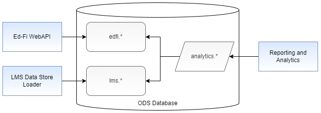
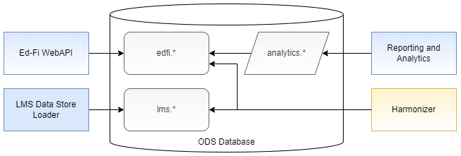
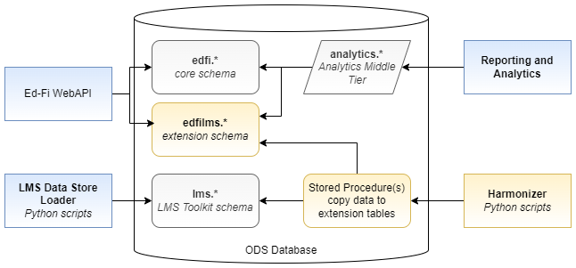

# LMS Harmonizer

## Overview

Utility / process for linking LMS data with SIS data in an Ed-Fi ODS. Assumes
that LMS data have been retrieved from an LMS via an [LMS
Extractors](./LMS-EXTRACTORS.md) and uploaded into tables in the lms schema via
[LMS Data Store Loader](./LMS-DATA-STORE-LOADER.md).

In summary, the LMS Harmonizer will be a Python script that calls SQL stored
procedures, which will copy LMS assignment data into tables created by an Ed-Fi
ODS/API extension. The orchestration of SQL calls will be documented so that the
process can easily be replicated in another tool of choice. A reporting process
will be built to provide data analysts with information about validation
failures (mismatched data).

## The Problem

The LMS data do not match perfectly with data retrieved from a SIS. What
processes should be used to "harmonize" the data from these two (and other)
source systems?

## To Harmonize on Write or on Read?

Eventually we anticipate building views in the Analytics Middle Tier to
denormalize the learning data for easier reporting and analysis. Would it be
possible to handle all of the harmonizing via these database queries ("on
read"); or do we need a process that actively matches data based on rules and
then updates existing records or inserts new ones ("on write")?

Handling this process "on write" requires a write action, above and beyond what
the LMS Data Store Loader does to populate its unique set of tables. Using an
"on read" process sounds attractive in that it simplifies the architecture.

Fig. 1: Views in the analytics schema join data from the edfi and lms schemas
when the views are accessed ("on read")

Fig. 2: Views in the analytics schema only read from the edfi  schema, and an
external Harmonizer application is responsible for copying data from lms schema
tables to edfi schema tables (or an alternate extension schema/namespace).

While Figure 1 is more attractive, it may not be feasible. This document will
carefully explore the parameters and conclude with a clear decision.

## Design Considerations

### Mapping Between Resources

In either design, records in the lms schema tables need to be conceptually
matched to records in the edfi schema tables. This may influence the key
read/write design decision.

* lms.​Assignment maps to:​ none
  * ​GradeBookEntry looks like a natural spot; however, it is assumed that the
    grade book entries should be controlled through the Student Information
    System, rather than directly from the Learning Management System. Therefore
    we will treat the assignments stored in the LMS as a separate concept that
    does not map into an existing table in the edfi schema.

  > [!INFO] This was a conclusion of the LMS SIG. Please see the SIG report out
  > for more detail.

* lms.AssignmentSubmission maps to: ​none
  * Could go to StudentGradeBookEntry ... however, see the note above.
* lms.AssignmentSubmissionType maps to: none
* lms.LMSSection maps to: Section
  * Because the LMS source systems do not the same natural key information for a
    section as represented in a SIS, there is no simple 1-to-1 matching process
    between the LMS Toolkit Section and the Ed-Fi Section.
  * SectionIdentifier alone is understood to be insufficient - in some SIS's
    this value is only unique within a course, hence the requirement to have
    both LocalCourseCode and SectionIdentifier in the natural key. However, the
    LMS systems do not necessarily support storing LocalCourseCode.
  * SchoolYear and SchoolId are not known from the LMS side. Term  on the LMS
    side might match with SessionName on the Ed-Fi side.
  * For a deeper dive, see [LMS - Joining Entities across
    Systems](./JOINING-ACROSS-ENTITIES.md)
* lms.LMSSectionActivity maps to: none
* lms.LMSSystemActivity maps to: none
* lms.LMSUser maps to edfi.Student and edfi.Staff
  * Assuming that the LMS has been rostered from the SIS, including copy of the
    SIS's unique identifier into the LMS, then we should be able to match on
    lms.LMSUser.SISUserIdentifier  to  edfi.Student.StudentUniqueId  or
    edfi.Staff.StaffUniqueId. Alternatively, we can match on email address,
    between lms.LMSUser.EmailAddress and a
    edfi.StudentEducationOrganizationAssociationElectronicMail entry.
* lms.LMSUserAttendanceEvent maps to edfi. StudentSectionAttendanceEvent
  * Suffers from the Section natural key problem. Will not be addressed in the
initial version of the LMS Harmonizer. lms. LMSUserLMSSectionAssociation maps to
edfi.StudentSectionAssociation
  * Suffers from the Section natural key problem. Will not be addressed in the
    initial version of the LMS Harmonizer.

That we cannot uniquely join lms.LMSSection to a single record in edfi.Section
implies that there may need to be multiple solutions for synchronizing the data
between systems, and additional information not stored in the LMS will be
required (for example, SchoolId). This could be resolved with either
architectural option. However, if applying on the "schema on read" architecture,
then the views will become significantly more complicated or will need to vary
from implementation to implementation.

## Validation and System of Record

What happens when a student in the lms.LMSUser  table cannot be matched to a
student in the edfi.Student table? What if there is a match on SISUserIdentifier
→ StudentUniqueId, but the First and Last Names on the two records differ? Some
sort of validation and reporting process will be needed in order to help data
analyst and others in the education agency recognize and address the mismatch
upstream, for example by correcting the information in the LMS.

For the purpose of the LMS Toolkit, it will be assumed that the SIS is the
system of record. Therefore although the LMS Toolkit records a student name, so
that the data are useful even in the absence of SIS data, the student name and
other similar information from the LMS will be ignored in the output reporting
from the LMS Toolkit.

## Requirements Summary

1. Build output reports / analytics from views in the Analytics Middle Tier.
1. Must be able to enrich the LMS data with additional data such as SchoolId and
   SchoolYear.
1. lms.LMSSection to edfi.Section  mapping rules may differ from one
   implementation to another, and thus the "harmonization process" must be able
   to support multiple sets of business rules.
1. Data analysts need to have reporting on validation errors.

## Architectural Vision

### LMS Harmonizer Application

Back to the question of harmonization on read vs. on write: both solutions will
require a degree of complexity to handle implementation-specific business logic
/ mapping rules. Denormalizing multiple tables into a view is a complex
exercise, generating SQL queries that can be difficult to use and to tune.
Therefore we choose to optimize upstream of the views, on write, by creating an
LMS Harmonizer application. While the overall system will be more complex in the
sense of having more moving parts, in this way each part will itself be simpler
and thus easier to think about and maintain.

A formal Ed-Fi extension, partially mirroring the LMS Toolkit design, will be
used to create new tables in an extension schema, edfilms. In the initial
release this extension will ignore activities, which are considered experimental
in the LMS Toolkit 1.0. Thus extension entities are needed to represent the
following data from the LMS Toolkit:

* Assignment
* Assignment Submission
* (Assignment Submission Type might be needed; this will be determined during
  the implementation process).

Creating the Ed-Fi extension has the further benefit of allowing direct
integration between LMS's and the Ed-Fi WebAPI. The Analytics Middle Tier views
would read from the edfi and edfi-lms tables exclusively, so that they do not
have a direct dependence on the LMS Toolkit.

The LMS Harmonizer will call stored procedures to perform write operations,
copying from the LMS Toolkit tables to the extension tables. The interface for
these stored procedures will be rigidly defined, so that the stored procedures
can be replaced easily to account for different business logic. Most likely,
every implementation will need to customize the stored procedures for
themselves. Thus the default set of procedures will only be examples.

In keeping with other aspects of the LMS Toolkit, the LMS Harmonizer will be
written as a Python script. The Harmonizer will call the stored procedures and
may also generate an exceptions (validation) report. Detailed design on the
reporting mechanism will be deferred until the development team is ready to work
on that user story.

### Rejected Alternative - Harmonizer Upload through the WebAPI

The Ed-Fi Alliance has historically been very vocal about loading data into the
ODS via the API; the vision above eschews that in favor of direct database
access. Why violate this norm?

1. The LMS Toolkit data are already in a database, and it would be very natural
   to land them in the ODS database itself rather than create a separate
   database.
2. Given that the data are in the same database, there will be a substantial
   performance difference between running a SELECT ... INTO or an UPDATE
   statement compared to pulling the data into a program and then uploading via
   the API.
3. These writes will only be into extension tables, not into the core edfi.*
   tables.
4. This entire project is experimentally exploring new ground, deliberately
   relaxing some principles in a learning mode.

> [!NOTE] Please note that this is analysis is only about the LMS Harmonizer,
> pulling data from the LMS Toolkit and inserting it into the Ed-Fi LMS
> extension. This analysis does not preclude LMS vendors from pushing directly
> into the Web API, so that an education agency does not need to run the LMS
> Toolkit.

## Implementation Plans

The initial release of the Harmonizer will target support for:

* Matching students in the LMS data to students in the Ed-Fi ODS
* Matching sections in the LMS data to sections in the Ed-Fi ODS
* Copying assignment information from the LMS data to new extension tables in
  the Ed-Fi ODS
* Reporting on student and section mismatches.

### Harmonizer Program and Stored Procedures

The Ed-Fi Alliance will build a single Harmonizer application along with a set
of reference stored procedures, along with guidance on how to replace the
out-of-the-box stored procedures with customized ones that solve the local
business logic requirements. To the extent feasible, the sample data and
reference stored procedures will represent realistic scenarios. The precise
logic of the harmonizer and the interfaces for the stored procedures will be
developed in real time while developing the application.

### Ed-Fi Extension

The Alliance will also produce a new sponsored extension for storing LMS data
directly in the ODS, making it accessible in the Ed-Fi ODS/API for Suite 3,
version 5.2, via a dynamic plugin.

As described above, the initial release of the Harmonizer will likely need three
domain entities, covering Assignments, Assignment Submissions, and Assignment
Submission Types (one-to-many relationship from Submission to Submission Type).
These will not extend existing domain concepts, thus avoiding some difficulties
in the database modeling.

The need for descriptors will be evaluated when the development team takes up
this work. If required, the descriptors will be provisioned in the normal
manner, through XML bulk upload, rather than directly running SQL statements.
