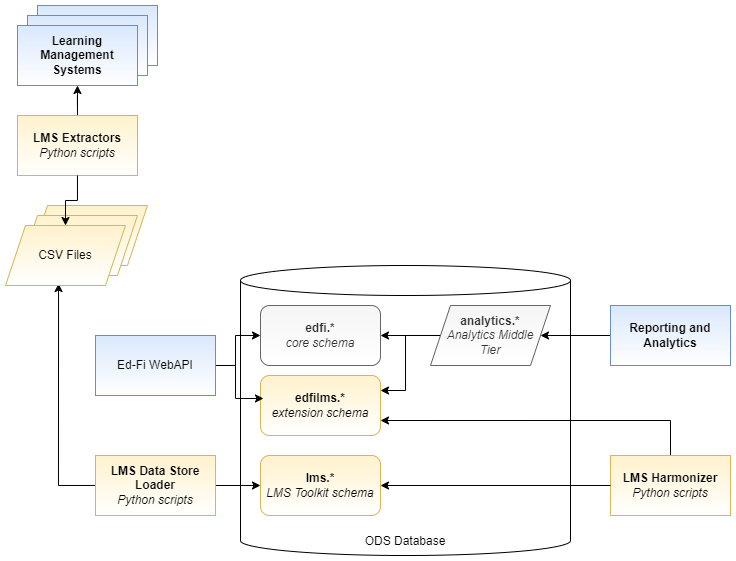
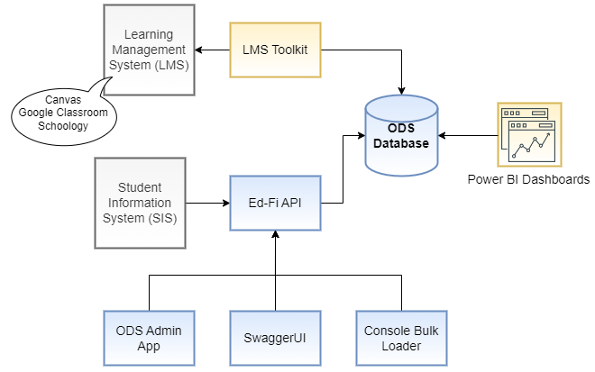
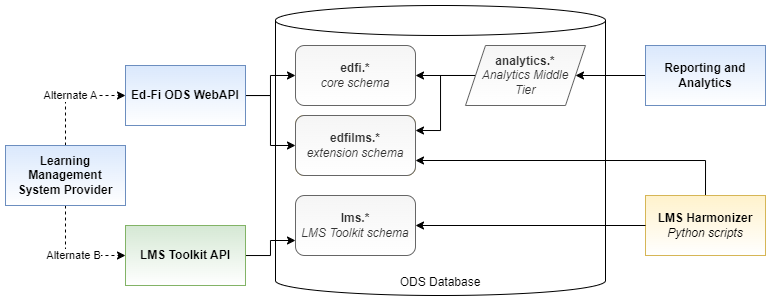

# LMS Toolkit Design

## Overview

The LMS Toolkit helps school districts unlock, transform and simplify, and use
instructional system data. The Toolkit's initial use cases focus on student
assignment completion / delinquency, and on general student activity and
"presence" in instructional systems. The Toolkit is available on GitHub to use
and modify under the terms of the Apache License, version 2.0.

## Technical Vision

The project will produce components that progressively support three integration
patterns:

1. Extraction and analysis of LMS data into CSV files
   * See [LMS Extractors](./LMS-EXTRACTORS.md)
2. Loading those CSV files into a long-term data store via an API
   * See [LMS Data Store Loader](./LMS-DATA-STORE-LOADER.md)
3. Synchronizing LMS data into an Ed-Fi ODS/API
   * See [LMS Harmonizer](./LMS-HARMONIZER.md)

## LMS Toolkit Components

## Starter Kit Diagram

## Alternate Design - Push Data Into an API

Pulling large sets of data from an LMS's API on a regular basis is not very
efficient for anyone, whether the end-user or the vendor supplying the API. The
LMS Extractors essentially have to retrieve all available data with every
download, because these systems do not provide a means for limiting to changed
data. The most efficient route would be for an LMS vendor to push data into an
API rather than use the Extractors.

Creating a formal Ed-Fi extension gives us the benefit of supporting this kind
of LMS vendor integration, directly into the ODS/API, without use of the LMS
Toolkit. This is depicted in Figure 3 above where the Ed-Fi WebAPI routes data
into the extension tables.

However, we are not yet certain that direct integration into the ODS - which is
to say, an LMS making API calls to the Ed-Fi WebAPI - is realistic because of
the natural key problems described above and other data integrity issues.

**Pending further feedback from the community and from vendors, the idea of
adding an API to the LMS Toolkit is on hold. For a more detailed analysis of the
challenges with integration to the Ed-Fi WebAPI, please see [LMS
API](./LMS-API.md).**

## Development Tools

The LMS Toolkit is based on Python scripts that have been developed and tested
on Python 3.9. Please see the repository [README](../../README.md) for more
information.
